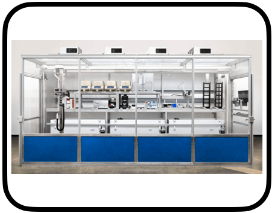
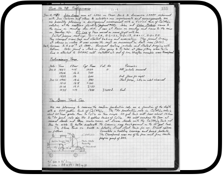
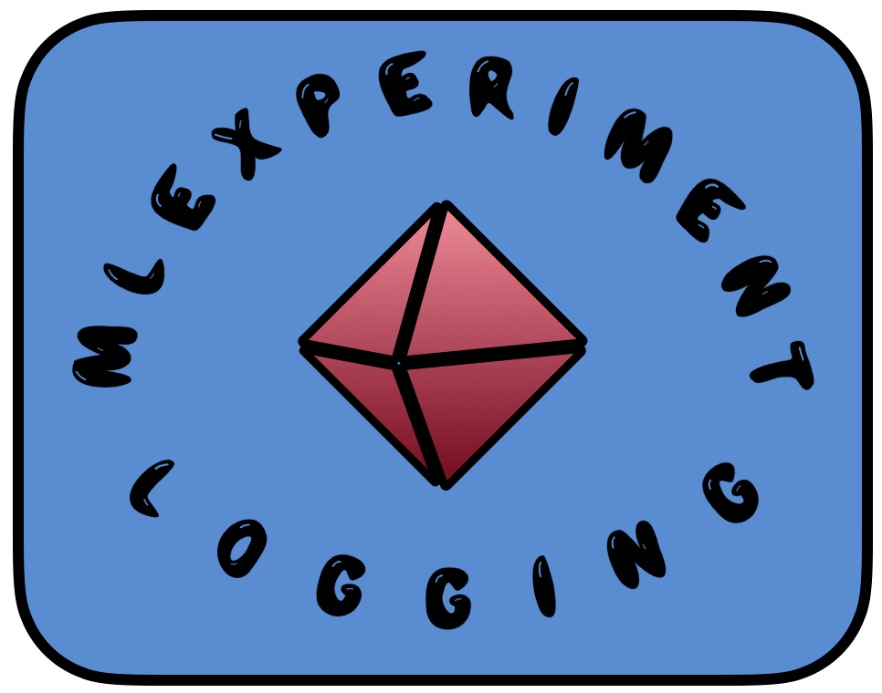
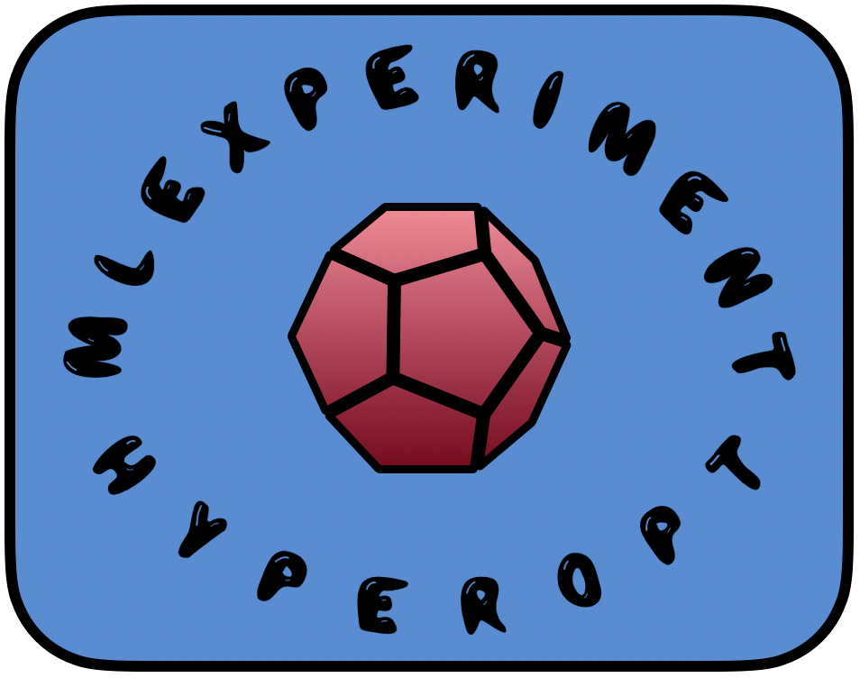
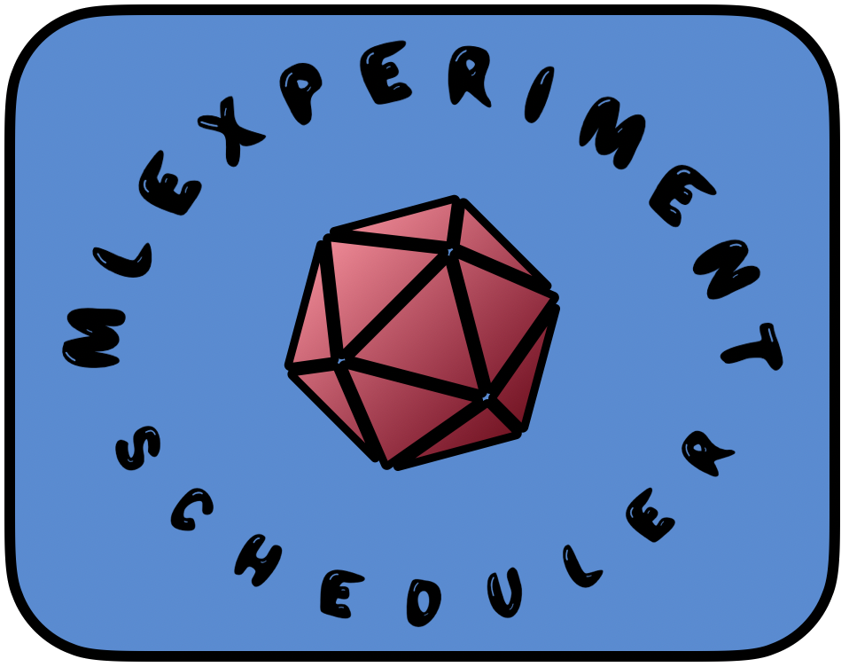
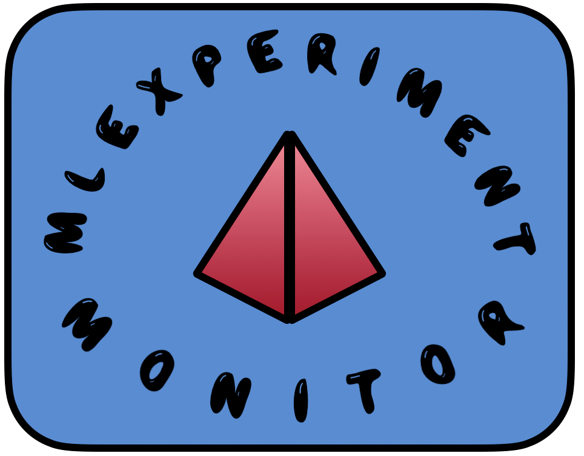
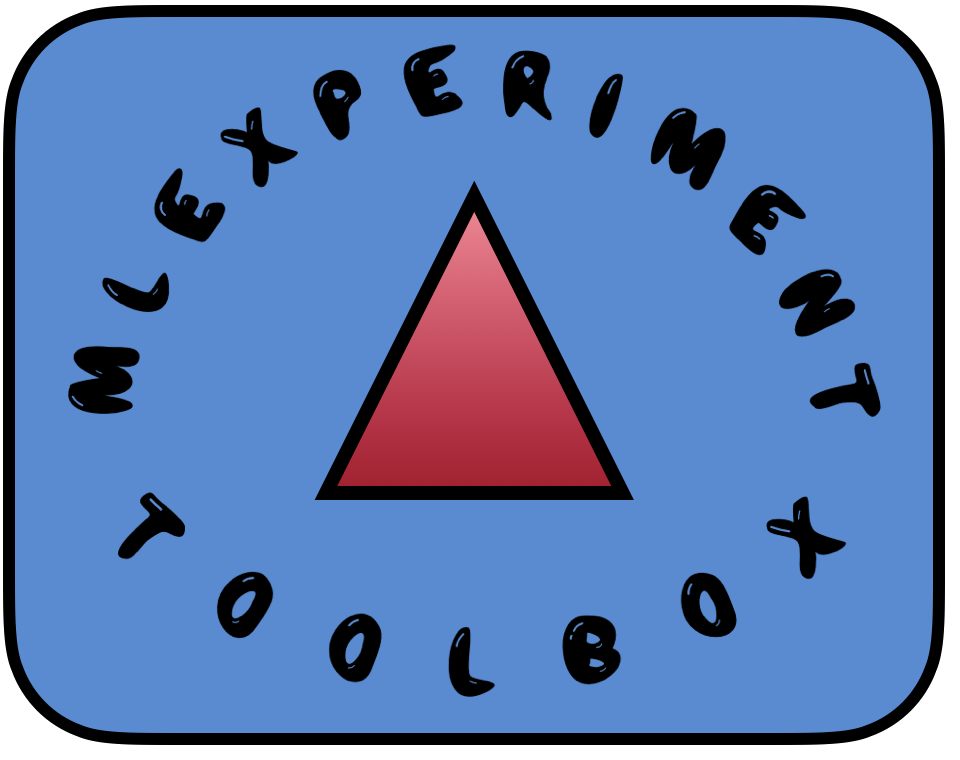
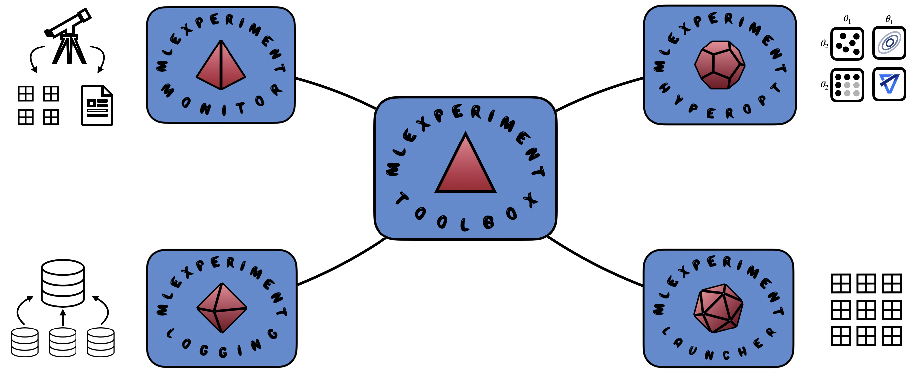

# Welcome to the MLE-Infrastructure 🔬

||   |   |  |  |
|:----:|:----: |:----: |:----:| :----:|
| Experiment Logging | Parameter Searches | Experiment Launch  | Experiment Protocol | Experiment Manager |
||   |  |  |  |
| [`mle-logging`](https://github.com/mle-infrastructure/mle-logging) | [`mle-hyperopt`](https://github.com/mle-infrastructure/mle-hyperopt) | [`mle-scheduler`](https://github.com/mle-infrastructure/mle-scheduler) | [`mle-monitor`](https://github.com/mle-infrastructure/mle-monitor)  | [`mle-toolbox`](https://github.com/mle-infrastructure/mle-toolbox) |
|  |  |   |  |   |
 |  |  |  |   |

The MLE-Infrastructure provides a reproducible workflow for distributed Machine Learning experimentation (MLE) with minimal engineering overhead. The core consists of 5 packages:

- [`mle-logging`](https://github.com/mle-infrastructure/mle-logging): Experiment logging with easy multi-seed and configuration aggregation.
- [`mle-hyperopt`](https://github.com/mle-infrastructure/mle-hyperopt): Hyperparameter Optimization with config export, refinement & reloading.
- [`mle-monitor`](https://github.com/mle-infrastructure/mle-monitor): Monitor cluster/cloud VM resource utilization & protocol experiments.
- [`mle-scheduler`](https://github.com/mle-infrastructure/mle-scheduler): Schedule & monitor jobs on Slurm, GridEngine clusters & GCP VMs.
- [`mle-toolbox`](https://github.com/mle-infrastructure/mle-toolbox): Glues everything together to manage & post-process experiments.

 

 

**Note I**: A template repository of an infrastructure-based project can be found in the [`mle-project`](https://github.com/mle-infrastructure/mle-project). You can inspect your experiment stack in an interactive web UI: [`mle-laboratory`](https://github.com/mle-infrastructure/mle-laboratory).

**Note II**: [`mle-logging`](https://github.com/mle-infrastructure/mle-logging), [`mle-hyperopt`](https://github.com/mle-infrastructure/mle-hyperopt), [`mle-monitor`](https://github.com/mle-infrastructure/mle-monitor) and [`mle-scheduler`](https://github.com/mle-infrastructure/mle-scheduler) are standalone packages and can be used independently of the utilities provided by the [`mle-toolbox`](https://github.com/mle-infrastructure/mle-toolbox).
